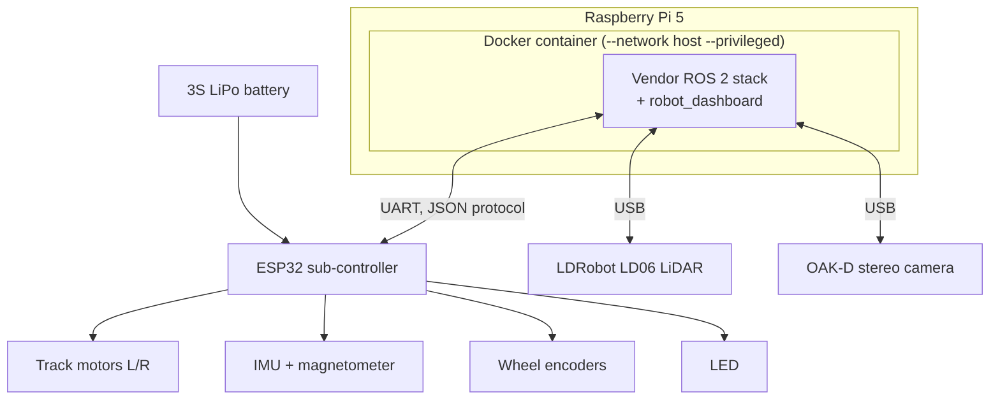
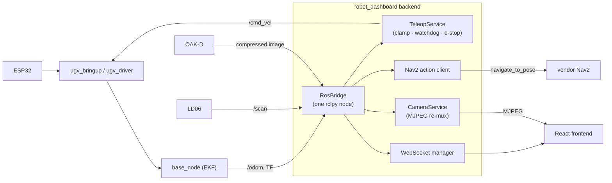

# UGV Beast Robot Workspace

A modern web dashboard and ROS 2 extension layer for the **Waveshare UGV Beast** — built to sit
cleanly *on top of* Waveshare's vendor stack without ever modifying it. Drive the robot, watch its
camera, visualize its sensors, run SLAM/Nav2, and manage it all from a browser — on your phone,
tablet, or laptop, no ROS tooling required on the client side.

> **Hardware this was built for:** Waveshare UGV Beast (tracked chassis) · Raspberry Pi 5 ·
> ESP32 sub-controller · LDRobot LD06 LiDAR · Luxonis OAK-D stereo camera · ROS 2 Humble.

---

## Contents

- [What's in here](#whats-in-here)
- [System architecture](#system-architecture)
- [Dashboard features](#dashboard-features)
- [Prerequisites](#prerequisites)
- [Getting started](#getting-started)
- [Using the dashboard](#using-the-dashboard)
- [Development environment](#development-environment-wsl--pi)
- [Documentation](#documentation)
- [Safety & design principles](#safety--design-principles)

---

## What's in here

This repository is **not** the vendor firmware/ROS stack that ships with the robot — that lives
separately on the Raspberry Pi (Waveshare's `ugv_ws`) and is treated as **read-only**. Instead,
this is a self-contained ROS 2 workspace that talks to the vendor stack purely through standard
ROS interfaces (topics, services, actions, TF), so it stays compatible even as Waveshare updates
their own software.

| Package | Runs on | Role |
|---|---|---|
| **`robot_dashboard`** | Pi | The web dashboard — FastAPI + rclpy backend, React/TypeScript frontend. The main deliverable of this repo. |
| `robot_interfaces` | Pi + dev machine | Shared custom message/service/action definitions. |
| `robot_perception` | Pi | Scaffold: consumes camera/LiDAR, publishes structured perception. |
| `robot_navigation` | Pi | Scaffold: typed action wrapping the vendor's Nav2 stack. |
| `robot_manipulation` | Pi | Scaffold: pan-tilt gimbal aiming (if fitted). |
| `robot_skills` | Pi | Scaffold: behavior/skill library. |
| `robot_bringup` | Pi + dev machine | Launch files that compose the packages above. |
| `robot_ai` | Dev machine | Scaffold: LLM decision layer. |
| `robot_mcp` | Dev machine | Scaffold: MCP server exposing the ROS graph as AI tools. |

The dashboard is fully built and working today; the `robot_ai` / `robot_perception` / etc.
packages are intentionally-minimal scaffolds — extension points for wiring in your own
navigation, perception, or LLM-driven behavior later.

---

## System architecture

### Layered overview

Three layers, each only talking to the one directly below it:

```
┌──────────────────────────────────────────────────────────────────────────┐
│  BROWSER (any device on your network)                                    │
│  React SPA — Dashboard · Manual Control+Camera · Sensors · Navigation ·   │
│  Robot Controls · Logs · Settings                                        │
└───────────────────────────────▲───────────────────────────────────────────┘
                                 │ HTTPS/WebSocket (JSON + MJPEG)
┌───────────────────────────────┴───────────────────────────────────────────┐
│  robot_dashboard BACKEND  (FastAPI + rclpy, runs on the Pi)               │
│  One rclpy node, lazy topic subscriptions, safety-gated teleop/e-stop     │
└───────────────▲────────────────────────────────────────────▲─────────────┘
                │ /cmd_vel, /goal_pose, actions            │ /scan, /odom,
                │ SLAM/Nav2 launch control                  │ /tf, camera
┌───────────────┴────────────────────────────────────────────┴─────────────┐
│  VENDOR ROS 2 STACK  (Waveshare ugv_ws, Docker — never modified)          │
│  ugv_bringup · ugv_driver · ugv_base_node · Nav2 · SLAM · depthai_ros     │
└───────────────▲───────────────────────────────────────────────────────────┘
                │ UART (JSON protocol) @115200
┌───────────────┴───────────────────────────────────────────────────────────┐
│  ESP32 SUB-CONTROLLER                                                    │
│  motors · IMU · magnetometer · wheel encoders · LED · battery monitor    │
└─────────────────────────────────────────────────────────────────────────┘
```

### Hardware architecture



### Dashboard data flow



### Extension points

Build your own perception/navigation/AI code against these stable seams — never edit the vendor
workspace directly:

| Seam | How |
|---|---|
| **Drive** | Publish `geometry_msgs/Twist` on `/cmd_vel`. |
| **Perceive** | Subscribe `/scan` (LiDAR), the camera's compressed image topic, `/odom`, and TF. |
| **Navigate** | Use Nav2's `navigate_to_pose` action, or publish `/goal_pose`. |
| **React to behaviors** | The vendor's `behavior` action (string-command based) for simple triggers. |
| **Add hardware** | Extend `robot_manipulation` for a gimbal/arm; the URDF and TF frames are ready for it. |

Full reverse-engineered documentation of the vendor stack — every topic, service, action, TF
frame, and hardware detail — is in [`docs/`](docs/INDEX.md).

---

## Dashboard features

- **Live telemetry** — battery, CPU/memory/temperature, ROS graph health, pose.
- **Manual Control** — virtual joystick, keyboard (WASD/arrows), and gamepad support, with the
  live camera feed on the same page (drive while watching). Server-enforced speed clamps, a
  300 ms input watchdog, single-driver lease (only one client drives at a time), and a hard
  e-stop that overrides everything.
- **Camera** — MJPEG stream, fullscreen, snapshot, and browser-side recording.
- **Sensors** — live LiDAR scan view, IMU/compass, odometry trail, TF health.
- **Navigation** — occupancy-grid map view, click-to-send-goal, saved waypoints, Nav2 status/cancel.
- **Robot Controls** — start/stop SLAM (Cartographer/GMapping) and Nav2, save maps, toggle LEDs —
  all via an allowlisted launch manager that only ever runs the vendor's own launch files.
- **Logs** — live `/rosout` stream with level filtering, search, and export.
- **Settings** — control-token management, ROS domain/DDS info.

All control actions (driving, e-stop, SLAM, lights, reboot) require an auth token — without one,
the dashboard is fully read-only.

---

## Prerequisites

- A Waveshare UGV Beast with its vendor software already set up and working (this project builds
  *on top of* that — see Waveshare's own documentation for initial robot setup).
- Raspberry Pi 5 running the vendor Docker image, reachable over SSH and your LAN.
- ROS 2 Humble (already present in the vendor Docker image on the Pi).
- Node.js (LTS) on whichever machine you build the frontend on.
- A development machine on the same network (Linux, WSL2, or macOS) for building and deploying.

---

## Getting started

### 1. Clone and configure

```bash
git clone https://github.com/<your-username>/ugv-beast-robot-ws.git ~/robot_ws
cd ~/robot_ws
cp src/robot_dashboard/config/dashboard.yaml.example src/robot_dashboard/config/dashboard.yaml
```

Edit `src/robot_dashboard/config/dashboard.yaml` and set a control token (leaving it unset keeps
the dashboard permanently read-only — safe default, but you won't be able to drive):

```bash
python3 -c "import secrets; print(secrets.token_urlsafe(24))"
```

### 2. Build the frontend

```bash
cd src/robot_dashboard/frontend
npm install
npm run build
cd ~/robot_ws
```

### 3. Build the ROS packages

```bash
source /opt/ros/humble/setup.bash
colcon build --packages-select robot_interfaces robot_dashboard
```

### 4. Deploy to the Pi

```bash
rsync -az --exclude build --exclude install --exclude log --exclude node_modules \
  ~/robot_ws/ <pi-user>@<pi-ip>:~/robot_ws/
```

Then, inside the Pi's ROS container:

```bash
source /opt/ros/humble/setup.bash
cd ~/robot_ws
colcon build --packages-select robot_interfaces robot_dashboard
```

### 5. Launch

Bring up the vendor drivers (LiDAR, IMU, motor control) and the dashboard together:

```bash
# Vendor stack (adjust env vars to your hardware — see docs/HARDWARE.md and docs/LIDAR.md)
export UGV_MODEL=ugv_beast
export LDLIDAR_MODEL=ld06
ros2 launch ugv_bringup bringup_lidar.launch.py &

# Camera (if fitted)
ros2 launch ugv_vision oak_d_lite.launch.py &

# Dashboard
source ~/robot_ws/install/setup.bash
ros2 launch robot_dashboard dashboard.launch.py
```

Open `http://<pi-ip>:8080` in a browser.

---

## Using the dashboard

| Page | What it's for |
|---|---|
| **Dashboard** | At-a-glance health: battery, ROS status, pose, system load. |
| **Manual Control** | Drive with joystick/keyboard/gamepad while watching the live camera feed. Enter your control token here to unlock. |
| **Sensors** | LiDAR scan, IMU/compass, odometry trail, TF status. |
| **Navigation** | View the SLAM map, click to send a goal, save/reuse waypoints. |
| **Robot Controls** | Start/stop SLAM and Nav2, save maps, toggle lights. |
| **Logs** | Live ROS log stream with filtering and export. |
| **Settings** | Control token, connection/DDS info. |

---

## Development environment (WSL ↔ Pi)

If you develop on Windows via WSL2, GUI tools (RViz2, rqt, Foxglove) can run natively on the WSL
side while the Pi runs only drivers — no X11 forwarding needed. This needs WSL2 mirrored
networking and matching CycloneDDS configuration on both machines.

Full step-by-step setup (SSH keys, `.wslconfig`, CycloneDDS, VS Code Remote-SSH) is in
[`docs/DEV_SETUP.md`](docs/DEV_SETUP.md). Convenience scripts: [`dev/`](dev/).

---

## Documentation

The [`docs/`](docs/INDEX.md) folder has full reverse-engineered documentation of the vendor stack,
gathered through read-only static analysis and live ROS introspection:

| Doc | Contents |
|---|---|
| [SYSTEM_ARCHITECTURE.md](docs/SYSTEM_ARCHITECTURE.md) | Full architecture, diagrams, extension points |
| [PACKAGE_SUMMARY.md](docs/PACKAGE_SUMMARY.md) | Every vendor package, node, and executable |
| [TOPICS.md](docs/TOPICS.md) / [SERVICES.md](docs/SERVICES.md) / [ACTIONS.md](docs/ACTIONS.md) | Full ROS interface reference |
| [TF_TREE.md](docs/TF_TREE.md) | Live TF tree and frame origins |
| [HARDWARE.md](docs/HARDWARE.md) | ESP32 protocol, sensors, power, device map |
| [NAVIGATION.md](docs/NAVIGATION.md) | Nav2, SLAM, localization options |
| [CAMERA.md](docs/CAMERA.md) / [LIDAR.md](docs/LIDAR.md) | Camera and LiDAR driver details |
| [DOCKER.md](docs/DOCKER.md) | Container image, mounts, networking |
| [DASHBOARD_DESIGN.md](docs/DASHBOARD_DESIGN.md) | The dashboard's own design rationale |
| [DEV_SETUP.md](docs/DEV_SETUP.md) | Dev environment setup (WSL/CycloneDDS/VS Code) |

---

## Safety & design principles

- **The vendor workspace is never modified.** Everything here talks to it only through ROS
  topics, services, actions, and TF — reinstalling or updating Waveshare's own software won't
  break this project.
- **Read-only by default.** No control token configured = the dashboard cannot drive the robot,
  change lights, or run SLAM, no matter who connects.
- **Server-side teleop safety.** Speed clamps, a 300 ms watchdog (stale input → auto-stop), a
  single-driver lease, and a hard e-stop are all enforced in the backend — a flaky client
  connection can't leave the robot driving blind.
- **Allowlisted actions only.** The launch manager (SLAM/Nav2 start-stop) only ever runs a fixed
  set of the vendor's own launch files — never arbitrary commands.
- **Destructive actions are opt-in.** Reboot/shutdown are disabled by default and require an
  explicit config flag even with a valid token.
