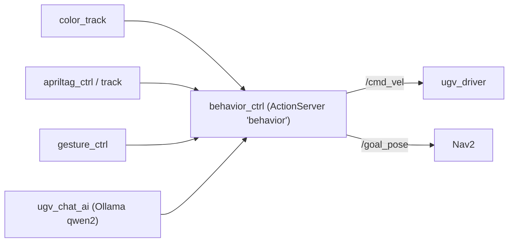

# Actions

## Custom action: `behavior`

The vendor stack has **one custom action**, which is the central arbitration point for
"do something" commands coming from vision and AI.

### `ugv_interface/action/Behavior`
```
# Goal
string command
---
# Result
bool result
---
# Feedback
bool feedback
```

- **Action name:** `behavior`
- **Server:** `behavior_ctrl` (package `ugv_tools`) — receives a string `command`, executes a motion/
  goal behavior, and reports success. It publishes `/cmd_vel` and `/goal_pose`, and subscribes
  `/odom` and `/robot_pose`.
- **Clients (static-derived):**
  - `ugv_vision`: `color_track`, `apriltag_ctrl`, `apriltag_track_0`, `apriltag_track_1`, `gesture_ctrl`
  - `ugv_chat_ai`: `app` (LLM decides a `command`, sends it as a goal)



> Not seen in `ros2 action list` during capture because `behavior_ctrl` and the vision nodes were
> not part of the `bringup_imu_ekf` launch. Start `ugv_tools behavior_ctrl` (and a vision node) to
> observe it live.

## Standard actions
- **Nav2** exposes the usual action servers when running: `navigate_to_pose`, `navigate_through_poses`,
  `compute_path_to_pose`, plus recoveries — see [NAVIGATION.md](NAVIGATION.md).

## Integration note
This `command`-string action is a convenient, low-friction seam. Two clean ways for **your** code to
plug in:
1. **Consume it:** have `robot_skills` implement its own richer action(s) in `robot_interfaces`, and
   optionally forward simple commands to `behavior` for vendor-provided motions.
2. **Replace it:** drive `/cmd_vel` and Nav2 directly from `robot_skills`, ignoring `behavior` — more
   control, no dependency on the string protocol.
Recommended: define typed actions in `robot_interfaces` (e.g. `GoTo`, `Track`, `Dock`) rather than
overloading a single `string command`.
