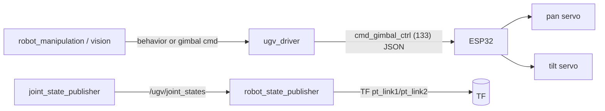

# Manipulation — Gimbal removed, Arm planned

> **Current state (2026-07-04):** the 2-DOF pan-tilt **gimbal has been physically removed** and a
> **robotic arm is planned but not yet mounted**. So there is currently **no articulated manipulator**
> on the robot. The `pt_*` frames below still appear in the URDF/TF (from `robot_state_publisher`
> reading `ugv_beast.urdf`) but have **no corresponding hardware** — treat them as stale until you
> update the URDF or mount the arm.
>
> **When you mount the arm** (Waveshare RoArm-class), its ESP32 command path is `cmd_arm_ctrl_ui: 144`
> (+ the servo commands below); point `robot_manipulation` at it and add the arm to a URDF your
> `robot_description` provides (don't edit the vendor URDF).

## Legacy: the pan-tilt gimbal (now removed)

## Evidence
- **Live TF:** `pt_base_link → pt_link1 (pan) → pt_link2 (tilt) → pt_camera_link`.
- **Base config:** `module_type: 0` (no arm module declared in the web-app config), but the URDF
  (`ugv_beast.urdf`, selected by `UGV_MODEL`) and live TF include the gimbal.
- **ESP32 commands** (`config.yaml`): `cmd_gimbal_ctrl: 133`, `cmd_gimbal_base_ctrl: 141`,
  `cmd_gimbal_steady: 137`; servo mgmt `cmd_servo_torque: 210`, `cmd_set_servo_id/mid: 501/502`.

## Kinematics
| Joint | Frame | DOF | Actuator |
|-------|-------|-----|----------|
| Pan | `pt_base_link → pt_link1` | yaw | bus servo (ESP32) |
| Tilt | `pt_link1 → pt_link2` | pitch | bus servo (ESP32) |
| Camera | `pt_link2 → pt_camera_link` | fixed | mounted camera |

## Control paths
1. **ROS (recommended):** joint states flow through `/ugv/joint_states`; the gimbal is commanded via
   `ugv_driver` (which encodes ESP32 gimbal frames). Vision nodes aim the gimbal indirectly through
   the **`behavior`** action.
2. **Direct ESP32:** the non-ROS `base_ctrl.py` exposes a `GimbalController('/dev/serial0', 115200)`
   with the `cmd_gimbal_*` codes — used by the web app, not ROS.

## For your `robot_manipulation`
- **Aim the camera:** compute pan/tilt to point `pt_camera_link` at a target (e.g. a detection in
  `robot_perception` or a `dock_frame`), then command the gimbal.
- **MoveIt:** for a 2-DOF gimbal MoveIt is overkill; simple inverse-kinematics (atan2 of target in
  `pt_base_link`) suffices. Keep MoveIt hooks optional for a future arm.
- **Do not** open `/dev/ttyAMA0` yourself — go through `ugv_driver` / `behavior`, or (if you must)
  add a thin gimbal-command bridge that the vendor driver exposes. Confirm the exact ROS gimbal topic
  by running the stack and `ros2 topic list` with vision active (the encode path lives in
  `ugv_driver`).
