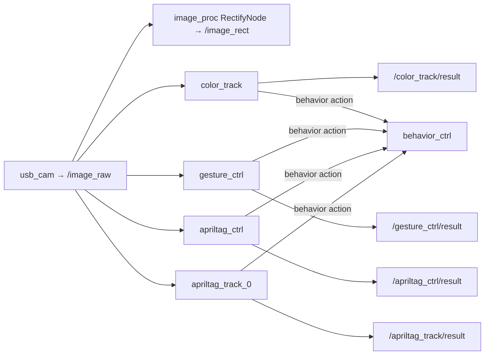

# Cameras & Vision

> **Current hardware (2026-07-04):** the pan-tilt **gimbal was removed** (arm planned), so the
> monocular **`pt_camera`** it carried is gone. The vendor `usb_cam` config still targets
> `/dev/video0` / `camera_name: pt_camera`, which **no longer enumerates** (the only `/dev/video*`
> are Pi-5 ISP nodes). The **working camera is the OAK-D stereo/depth camera.**

**OAK-D (Luxonis, Intel Movidius MyriadX `03e7:2485`)** — ✅ detected & healthy, mounted at
`3d_camera_link`. Driver: `depthai_ros_driver` (**installed** in `/opt/ros/humble`), vendor launch
`ugv_vision/launch/oak_d_lite.launch.py`. ⚠️ Currently negotiating **USB2 (480 Mbps)** — use a USB3
(blue) port/cable for full bandwidth, or set `usb2Mode`/reduce resolution in the launch.

Historical (present only if you re-add a plain USB/CSI cam):
- **`usb_cam`** → `/image_raw` (`ugv_vision/launch/camera.launch.py`, params
  `ugv_vision/config/params.yaml`, `video_device: /dev/video0`, 640×480 mjpeg).
- **Gimbal camera** `pt_camera_link` — removed with the gimbal.

## Primary camera driver
- **Package/exe:** `usb_cam` / `usb_cam_node_exe`, node name `usb_cam`.
- **Launch:** `ugv_vision/launch/camera.launch.py`.
- **Params:** `ugv_vision/config/params.yaml`.
- **Rectification:** `image_proc::RectifyNode` (composable) — remaps `image→image_raw`,
  publishes `image_rect`.
- **Host devices:** `/dev/video19…37` (Pi 5 enumerates many libcamera/CSI nodes; USB cam picks one).

## Vision nodes (`ugv_vision`)
| Node | Input | Output | Technique | Behaviour |
|------|-------|--------|-----------|-----------|
| `color_track` | `/image_raw` | `/color_track/result` | HSV color blob tracking | sends `behavior` goal to center target |
| `kcf_track` | `/image_raw` | (tracked ROI) | KCF correlation tracker | object following |
| `gesture_ctrl` | `/image_raw` | `/gesture_ctrl/result` | MediaPipe hand/gesture | gesture → `behavior` command |
| `apriltag_ctrl` | `/image_raw` | `/apriltag_ctrl/result` | AprilTag detect | tag-driven `behavior` |
| `apriltag_track_0` | `/image_raw` | `/apriltag_track/result` | AprilTag detect | publishes result image |
| `apriltag_track_1` | `/apriltag/track` (Int8) + TF | — | TF `base_footprint→dock_frame` | docking approach |
| `apriltag_track_2` | TF | — | TF `map→dock_frame` | map-frame docking |

`apriltag_ros` provides the underlying tag detection; docking uses the `dock_frame` TF.

## Depth camera (`3d_camera_link`)
- Launched via `ugv_vision/launch/oak_d_lite.launch.py` (DepthAI). Provides RGB + depth + point cloud
  for `rtabmap_rgbd` SLAM (`ugv_slam/launch/rtabmap_rgbd.launch.py`).

## For your code
- **Perception seam:** subscribe `/image_raw` (raw) or `/image_rect` (rectified). For depth, use the
  OAK-D topics under its namespace.
- Put your CV/ML in **`robot_perception`**. Heavy models can run on **WSL** (subscribe over the DDS
  link); lightweight/low-latency detection can run on the **Pi**.
- Reuse the vendor `dock_frame` TF for docking rather than re-detecting tags.
