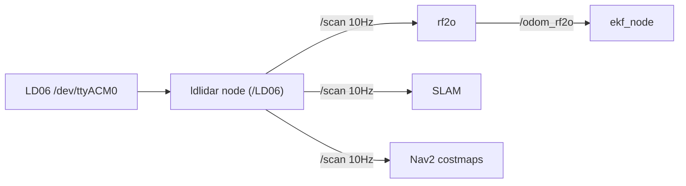

# LiDAR

## Hardware (corrected — this robot uses LD06)
- **Model:** LDRobot **LD06** (LDLiDAR LD06), 360° 2D scanning lidar.
- **Connection:** USB-serial `/dev/ttyACM0` (a QinHeng CH340 USB-serial adapter, `1a86:55d3`).
- **Driver package:** `ldlidar` (in `ugv_else`, supports LD06 / LD19 / STL27L).
- **Selected by:** env var **`LDLIDAR_MODEL=ld06`** → loads `ldlidar/launch/ld06.launch.py`.

> An earlier attempt with `LDLIDAR_MODEL=stl27l` failed (`communication is abnormal`, baud mismatch)
> because the unit is an **LD06**, not an STL27L. With `LDLIDAR_MODEL=ld06` it works.

## ROS interface
| Item | Value |
|------|-------|
| Topic | `/scan` (`sensor_msgs/msg/LaserScan`) |
| Rate | **10 Hz** (live-verified) |
| Frame | `base_lidar_link` (driver param `frame_id`) |
| Params | `topic_name: scan`, `frame_id: base_lidar_link`, `port_name: /dev/ttyACM0` |

## Status: ✅ WORKING
Live test: `/LD06` node up, `/scan` steady at 10 Hz, `rf2o_laser_odometry` acquired first scan and
configured. Bring up with:
```bash
export UGV_MODEL=ugv_beast LDLIDAR_MODEL=ld06
ros2 launch ugv_bringup bringup_lidar.launch.py
```

## Consumers
- `rf2o_laser_odometry` → `/odom_rf2o` (scan-matching odometry, fused by EKF).
- SLAM: cartographer / gmapping / rtabmap.
- Nav2: costmap obstacle layer + AMCL/EMCL2 localization.



## For your code
- `robot_perception` / `robot_navigation` subscribe `/scan`, use TF `base_lidar_link`.
- Don't relaunch the vendor lidar with edits; wrap `ldlidar/launch/ld06.launch.py` from
  `robot_bringup` with a params override if you need different settings.
