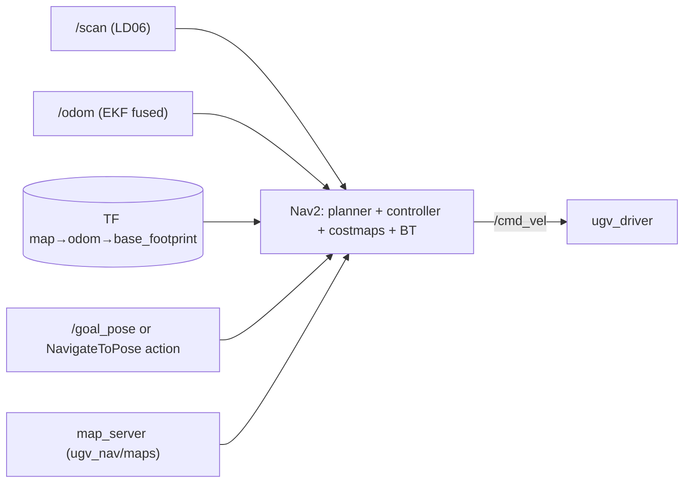

# Navigation, SLAM & Localization

Navigation is standard **Nav2** (`nav2_bringup`) configured by `ugv_nav`, fed by lidar `/scan`,
fused odometry `/odom`, and the `map → odom → base_footprint` TF chain.

## Stack overview


## SLAM (`ugv_slam`) — build a map
| Launch | Method | Output |
|--------|--------|--------|
| `cartographer.launch.py` | Google Cartographer 2D | occupancy grid + `map` TF |
| `gmapping.launch.py` | slam_gmapping (particle filter) | occupancy grid |
| `rtabmap_rgbd.launch.py` | RTAB-Map with depth camera | 2D/3D map |
Save maps via the `MapSave` service (see [SERVICES.md](SERVICES.md)) into `ugv_nav/maps/`.

## Localization (on a saved map)
- **AMCL** (adaptive MCL) — param sets `amcl_*.yaml`.
- **EMCL2** (`emcl2_ros2`) — param sets `emcl_*.yaml`.
- **RTAB-Map** localization — `rtabmap_*.yaml`.

## Local planners / controllers
- **DWB** (`*_dwa.yaml`) — DWA-style Nav2 controller.
- **TEB** (`teb_local_planner`, `*_teb.yaml`) — Timed-Elastic-Band, with `costmap_converter`.

## Param matrix (`ugv_nav/param/`)
```
amcl_dwa.yaml    amcl_teb.yaml       ← AMCL localization × {DWB, TEB}
emcl_dwa.yaml    emcl_teb.yaml       ← EMCL2 × {DWB, TEB}
rtabmap_dwa.yaml rtabmap_teb.yaml    ← RTAB-Map × {DWB, TEB}
slam_nav.yaml                        ← SLAM + navigation simultaneously
maps/map.yaml, maps/map_server_params.yaml
```
Launches: `ugv_nav/launch/nav.launch.py`, `nav_rtabmap.launch.py`, `slam_nav.launch.py`,
and `nav_bringup/{bringup_launch_cartographer, cartographer_localization, nav2_bringup}.launch.py`.

## Exploration
`explore_lite` (frontier-based) can drive Nav2 to autonomously map an unknown area.

## Odometry fusion
`base_node_ekf` + `robot_localization/ekf_node` fuse wheel odom (`/odom/odom_raw`), IMU (`/imu/data`),
and laser odom (`/odom_rf2o`) → `/odom` + `odom→base_footprint` TF.

## For your `robot_navigation`
- **Send goals** via the Nav2 **`navigate_to_pose`** action (preferred) or publish **`/goal_pose`**
  (`PoseStamped`, frame `map`). Don't reimplement planning — wrap Nav2.
- **Costmap layers / behavior tree:** extend by supplying your own params from `robot_navigation`
  (reference vendor `nav2_bringup`, override params) — never edit `ugv_nav`.
- **Waypoint / mission logic** belongs in `robot_skills` (calls Nav2 actions), with `robot_ai`
  choosing destinations.
- Reuse a vendor param set (e.g. `amcl_teb.yaml`) as your starting baseline.
