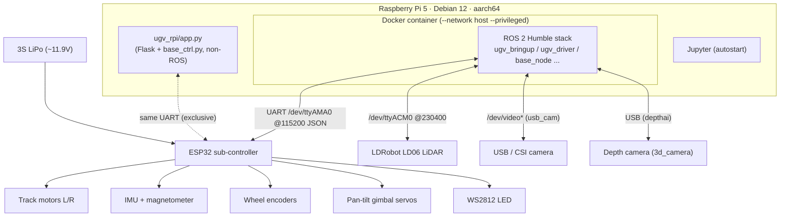
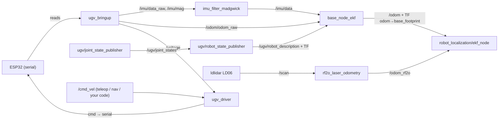
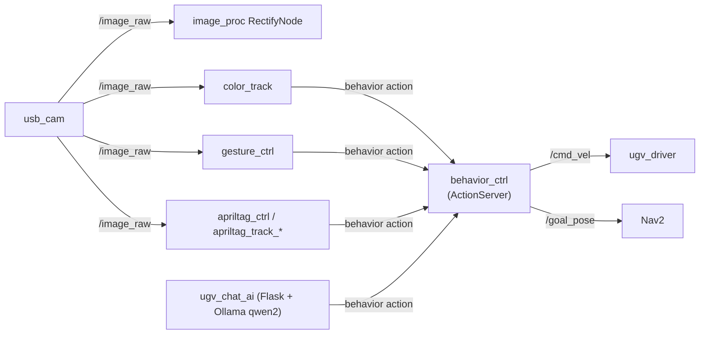
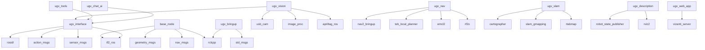

# System Architecture — UGV Beast

## 1. Layered overview

The robot has **three stacked control layers**. The bottom two are vendor; the top layer is where
**your** `~/robot_ws` code lives.

```
┌──────────────────────────────────────────────────────────────────────┐
│  YOUR CODE  (~/robot_ws — hybrid: Pi + WSL)                            │
│  robot_ai · robot_mcp · robot_perception · robot_navigation ·         │
│  robot_manipulation · robot_skills · robot_bringup · robot_interfaces  │
│  → interfaces ONLY via topics / services / actions / TF               │
└───────────────▲────────────────────────────────────────────▲─────────┘
                │ cmd_vel, goal_pose, behavior action,        │ /image_raw,
                │ Nav2 goals                                  │ /scan, /odom, /tf
┌───────────────┴────────────────────────────────────────────┴─────────┐
│  VENDOR ROS 2 STACK  (Docker: dudulrx0601/ugv_rpi_ros_humble)         │
│  ugv_bringup ─ ugv_driver ─ ugv_base_node ─ ugv_vision ─ ugv_nav ─    │
│  ugv_slam ─ ugv_tools ─ ugv_chat_ai ─ ugv_web_app  + ugv_else deps    │
└───────────────▲───────────────────────────────────────────────────────┘
                │ JSON over UART  /dev/ttyAMA0 @115200
┌───────────────┴───────────────────────────────────────────────────────┐
│  ESP32 SUB-CONTROLLER ("lower computer")                              │
│  motors · IMU · magnetometer · wheel encoders · gimbal servos · LED   │
└───────────────────────────────────────────────────────────────────────┘

   Parallel NON-ROS layer (mutually exclusive on the serial port):
   ~/ugv_rpi/app.py  (Flask web UI + base_ctrl.py)  ── same UART ──┘
```

## 2. Hardware architecture



## 3. Node graph (core driving stack — live-confirmed)



## 4. Behavior / vision / AI graph _(static-derived)_



## 5. Package dependency graph (ugv_main → key deps)



## 6. Extension points — where YOUR code attaches

Build against these **stable seams**; never edit vendor packages.

| Your package | Consumes (sub) | Produces (pub / calls) | Vendor seam |
|--------------|----------------|------------------------|-------------|
| `robot_perception` | `/image_raw`, `/scan`, `/odom`, TF | your detection/percept topics | camera + lidar drivers |
| `robot_navigation` | `/odom`, `/scan`, `/tf`, costmaps | `/goal_pose`, Nav2 action goals | `ugv_nav` (Nav2) |
| `robot_manipulation` | `/tf` (`pt_*` frames) | gimbal commands (via ESP32 cmd or a bridge) | pan-tilt gimbal |
| `robot_skills` | `/odom`, percepts | `/cmd_vel`, **`behavior` action** | `ugv_driver`, `behavior_ctrl` |
| `robot_ai` | percepts, state | intents → `robot_skills` | (top of stack) |
| `robot_mcp` | any topic/service/action | tool calls into the graph | whole graph |
| `robot_bringup` | — | launches your nodes | composes, references vendor launch |
| `robot_interfaces` | — | your msg/srv/action | shared types |

**Primary control seams**
- **Drive:** publish `geometry_msgs/Twist` on **`/cmd_vel`** → `ugv_driver` → ESP32.
- **Navigate:** send Nav2 goals / publish **`/goal_pose`** (PoseStamped, `map` frame).
- **Behaviors:** call the **`behavior`** action (`ugv_interface/action/Behavior`, `string command`).
- **Perceive:** subscribe **`/image_raw`**, **`/scan`**, **`/odom`**, and read **TF**.
- **Localize:** consume the **`map → odom → base_footprint`** TF chain.

**Hard caveats**
- Do not run your own base-serial driver — the vendor `ugv_bringup`/`ugv_driver` (or `app.py`) owns
  `/dev/ttyAMA0`. Drive through `/cmd_vel`.
- Match DDS settings across machines (see [DOCKER.md](DOCKER.md) and the dev-env setup): CycloneDDS +
  shared `ROS_DOMAIN_ID`.
