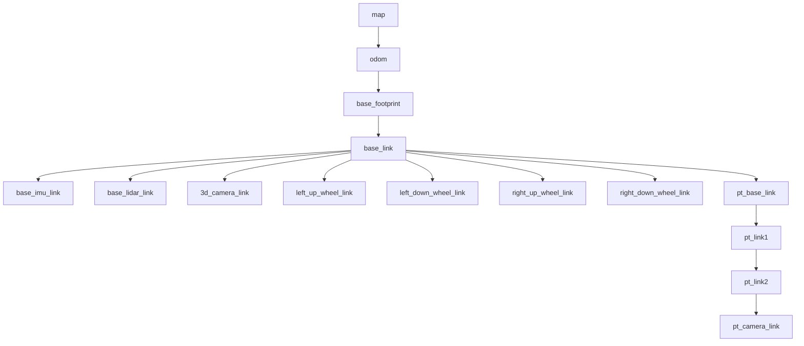

# TF Tree (live-captured)

Captured from `/tf_static` and `/tf` while `bringup_imu_ekf` was running.

```
map                                (SLAM / AMCL / EMCL — when localization runs)
└── odom                           (odom_frame; from base_node_ekf, pub_odom_tf: true)
    └── base_footprint             (base_footprint_frame)
        └── base_link              (main rigid body)
            ├── base_imu_link      (IMU mount)
            ├── base_lidar_link    (LDRobot LD06)
            ├── 3d_camera_link     (depth camera, e.g. OAK-D-Lite)
            ├── left_up_wheel_link     ┐
            ├── left_down_wheel_link   │ track/wheel links (animated by
            ├── right_up_wheel_link    │ joint_state_publisher)
            ├── right_down_wheel_link  ┘
            └── pt_base_link       (pan-tilt gimbal base)   ⚠ STALE: gimbal removed
                └── pt_link1       (PAN joint)              ⚠ hardware no longer present
                    └── pt_link2   (TILT joint)             ⚠ (still in URDF → still in TF)
                        └── pt_camera_link   (gimbal camera — removed)

dock_frame                          (published by apriltag docking, when active — static-derived)
```



## Frame origins

| Frame | Published by | Kind | Notes |
|-------|--------------|------|-------|
| `map` | SLAM (cartographer/gmapping/rtabmap) or AMCL/EMCL2 | dynamic | Only when localization/SLAM runs. |
| `odom` | `base_node_ekf` (`pub_odom_tf: true`) | dynamic | `odom_frame` param = `odom`. |
| `base_footprint` | `base_node_ekf` | dynamic | Ground projection; Nav2 robot base frame. |
| `base_link` | URDF via `robot_state_publisher` | static | Rigid body root. |
| `base_imu_link` | URDF static | static | `imu_joint`. |
| `base_lidar_link` | URDF static | static | LD06 mount (driver frame `base_lidar_link`/`base_laser`). |
| `3d_camera_link` | URDF static | static | Depth camera mount. |
| `*_wheel_link` ×4 | `joint_state_publisher` → `robot_state_publisher` | dynamic | Visual only. |
| `pt_base_link` | URDF static | static | Gimbal base on `base_link`. |
| `pt_link1` | `robot_state_publisher` (pan joint) | dynamic | Pan DOF. |
| `pt_link2` | `robot_state_publisher` (tilt joint) | dynamic | Tilt DOF. |
| `pt_camera_link` | URDF static (on `pt_link2`) | static | Gimbal camera optical mount. |
| `dock_frame` | `apriltag` docking node | dynamic | Target frame for AprilTag docking. |

## For your code
- **RViz2 Fixed Frame:** use `base_footprint` (no map) or `map` (with SLAM/localization).
- **Robot pose:** `tf_buffer.lookup_transform('map', 'base_footprint', ...)`.
- **Gimbal aiming:** the vendor `apriltag_track_2` looks up `map`→`dock_frame`; `apriltag_track_1`
  uses `base_footprint`→`dock_frame`. `robot_manipulation` should reason in `pt_base_link` /
  `pt_camera_link`.
- **Model selection:** the URDF (and thus these frames) is chosen by `UGV_MODEL=ugv_beast`.
